###### 写在前面：章节标题用一号标题、章节子标题从三号标题开始

----

# 设计模式引言

### 一、什么是设计模式

​	*每一个模式描述了一个在我们周围不断重复发生的问题，以及该问题的解决方案的核心。这样，你就能一次又一次地使用该方案而不必做重复劳动。*

### 二、一个设计模式的四要素

* 模式名称、问题、解决方案、效果

### 三、MVC 设计模式

* Model、View、Controller 三元组
* “订购、通知” 协议

### 四、设计模式的应用场景

* （较难）应用程序：内部复用性、可维护性、可扩充性、减少平台依赖
* （很难）工具箱：强调**代码复用**、避免假设和依赖
* （最难）框架：强调**设计复用**

### 五、模式&框架的异同

* 设计模式比框架更抽象
* 设计模式比框架更小，即框架能包括多个设计模式，反之不能
* 框架比设计模式更特例化

### 六、什么时候用设计模式？

#### 1. 设计模式的缺点

* 设计复杂、会降低系统的性能

#### 2. 设计模式的优点

* 灵活性、可扩展性、便携性

----

<div STYLE="page-break-after: always;"></div>

# 抽象工厂模式-Abstract Factory

1. 意图：提供一个**创建一系列相关或相互依赖对象**的接口，而无需指定他们具体的类
2. 别名：Kit
3. 动机：考虑一个支持多种视感标准的用户界面工具包，如为滚动条、按钮、窗口等证件定义不同的外观和行为。为了保证视感风格标准间的可移植性，应用中不应该为某一特定的视感外观硬编码它的窗口组件。
4. 适用性：
   * 一个系统要独立于它产品的创建、组合和表示时
   * 一个系统要有多个产品系列中的一个来配置时
   * 强调一系列相关的产品对象的设计以便进行**联合使用**时
   * 虽然提供了一个产品类库，只想显示他们的接口而不是实现时
5. 结构：
   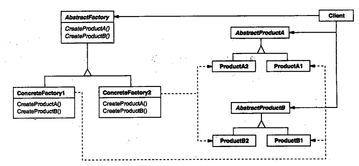
6. 参与者：
   * AbstractFactory：声明一个创建抽象产品对象的操作接口
   * ConcreteFactory：实现创建具体产品对象的操作
   * AbstractProduct：为一类产品对象声明一个接口
   * ConcreteProduct：定义一个将被相应工厂创建的产品对象、实现AbstractProduct接口
   * Client：仅适用由AbstractFactory和AbstractProduct类声明的接口
7. 协作：
   * 运行时创建一个ConcreteFactory类的视力
   * AbstractFactory将产品对象的创建延迟到它的ConcreteFactory子类
8. 效果：抽象工厂模式有以下优缺点
   1. 分离了具体的类，将客户与类的实现分离
   2. 使得易于交换产品系列
   3. 有利于产品的一致性
   4. 难以支持新种类的产品
9. 例子：
   **一个支持两种风格组件的窗口**
   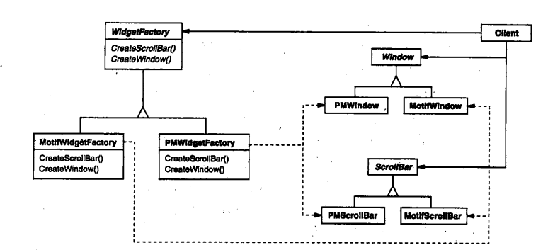

----

<div STYLE="page-break-after: always;"></div>

# 生成器模式-Builder

1. 意图：将一个复杂对象的**构建**与它的**表示**分离，使得同样的构建过程可以创建不同的表示
2. 动机：一个RTF文档交换格式的阅读器，应该能将RTF转换为多种正文格式，即对相同的对象，可以选择不同的操作方式
3. 适用性：
   * :question:当创建复杂对象的算法，应该独立于该对象的组成部分，以及它们的装配方式时
   * 当构造过程必须允许，被构造的对象，有不同的表示时
4. 结构：
   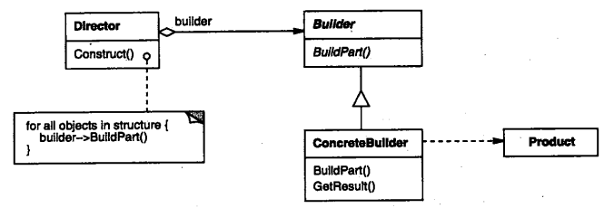
5. 参与者：
   * Builder：为创建一个Product对象的各个部件指定抽象接口
   * ConcreteBuilder：
     * 实现Builder的接口以构造和装配该产品的各个部件
     * 定义并明确它所创建的表示
     * 提供一个检索产品的接口
   * Director：构造一个使用Builder接口的对象
   * Product：
     * 表示被构造的复杂对象
     * 包含定义组成部件的类
6. 协作：
   * 客户创建Director对象，并用它所想要的Builder对象进行配置
   * 一旦产品部件被生成，导向器就会通知生成器
   * 生成器处理导向器的请求，并将部件添加到该产品中
   * 客户从生成器中检索产品
     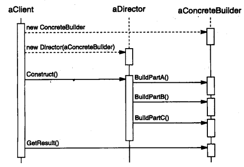
7. 效果：
   * 使你可以改变一个产品的内部表示
   * 将构造代码和表示代码分开
   * 使你可对构造过程进行更精细的控制
8. 例子：
   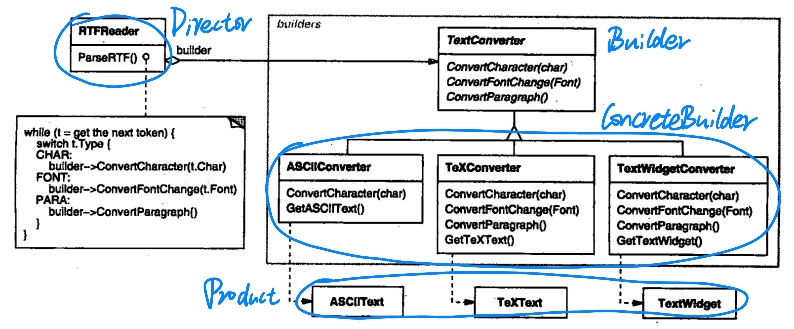
9. Builder pattern 和 Abstract Factory pattern的对比
   * Builder pattern
     * Builder 负责装配产品
     * 一步一步地生产产品
   * Abstract Factory pattern
     * 用户负责装配产品
     * Factory 一次生产完所有的产品

----

<div STYLE="page-break-after: always;"></div>

# 工厂方法模式-Factory Method

1. 意图：定义一个用于创建对象的接口，让子类决定实例化哪一个类。即，使一个类的实例化延迟到其子类

2. 别名：虚构造器（Virtual Constructor）

3. 动机：:question:框架使用抽象类定义和维护对象之间的关系。

4. 适用性：

   * :question:当一个类不知道它所必须创建的对象的类的时候,，如

     ```c++
     Application::NewDocument(){
         Document* doc = new Document();
         docs.Add(doc);
         doc->Open();
     }
     ```

     ==在编写此段代码时，除了用If-Else判断，不可能确定当前的抽象 *Document* 到底对应的哪一子类，所以此段代码如果一旦写死，将无法改变 *doc* 的类型==

   * 当一个类希望由它的子类来指定它所创建的对象的时候

   * 当类将创建对象的职责委托给多个帮助子类中的某一个，并且你希望将哪一个帮助子类是代理者，这一信息局部化的时候

5. 结构：
   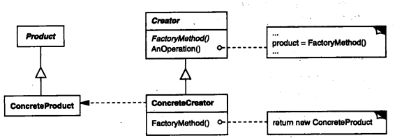

6. 参与者：

   * Product：定义工厂方法所创建的对象的接口
   * ConcreteProduct：实现Product接口
   * Creator：
     * 声明工厂方法，该方法返回一个Product类型的对象。
     * 可以调用工厂方法以创建一个Product对象
   * ConcreteCreator：重定义工厂方法，以返回一个ConcreteProduct实例

7. 效果：

   * 为子类提供挂钩
   * 连接平行的类层次

8. 例子：
   **Application 想要打开 Document**
   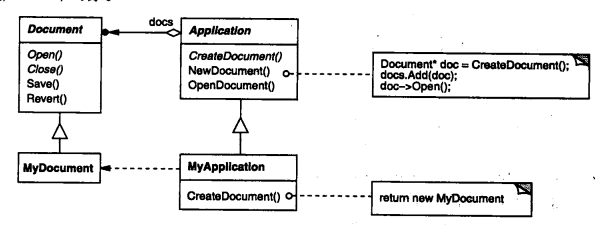

----

<div STYLE="page-break-after: always;"></div>

# 原型模式-Prototype

1. 意图：用原型实例指定创建对象的种类，并且通过拷贝这些原型创建新的对象
2. 动机：对于一个图形编辑器框架，其已经实现了添加元素并展示的接口，但是其内部代码肯定没有添加我们自定义类的代码。但是如果该API内部设置了一个变量，用于存储自定义的变量，在需要添加的时候会拷贝一份该对象并添加，那么对此API的复用会变得更加容易
3. 适用性：
   * 当要实例化的类是在运行时刻指定时，例如通过动态装载
   * 为了避免创建一个与产品类层次平行的工厂类层次
   * 当一个类的实例只能有几个不同状态组合中的一种时
4. 结构：
   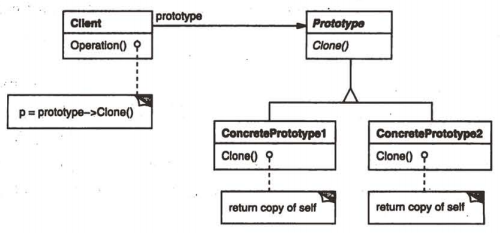
5. 参与者：
   * Prototype：声明一个克隆自身的接口
   * ConcretePrototype：实现一个克隆自身的操作
   * Client：让一个原型克隆自身从而创建一个新的对象，即上述所提到的框架
6. 效果：
   * 运行时刻增加和删除产品
   * 改变值以制定新对象
   * 改变结构以指定新对象
   * 减少子类的构造
   * 用类动态配置应用

----

<div STYLE="page-break-after: always;"></div>

# 适配器模式-Adapter

1. 意图：将一个类的接口转换成客户希望的另一个接口

2. 别名：包装器 Wrapper

3. 动机：有时，为复用而设计的工具箱类不能够被复用的原因仅仅是因为它的接口与专业应用领域所需要的接口不匹配

4. 适用性：

   * 想使用一个已经存在的类，而它的接口不符合你的需求
   * 想创建一个可以复用的类，该类可以与其他不相关或不可预见的类协同工作
   * 对象适配器：想使用**一些**已经存在的子类，但是不可能对每一个都进行子类化以匹配他们的接口，对象适配器可以适配它的父类接口

5. 结构：

   ==有多继承结构和对象组合结构==

   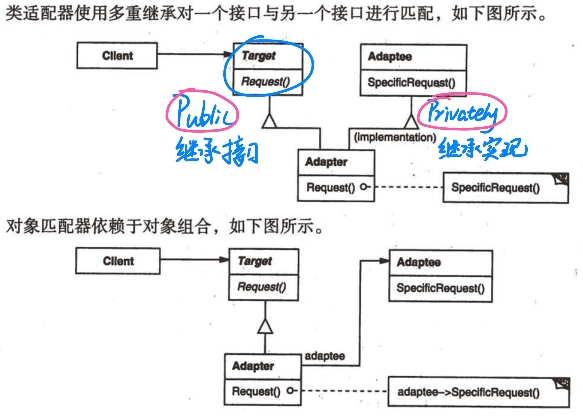

6. 参与者：

   * Target：定义Client使用的与特定领域相关的接口
   * Adaptee：定义一个已经存在的接口，这个接口需要适配
   * Adapter：对Adaptee的接口与Target的接口进行适配

7. 效果：

   * 类适配器重定义Adaptee的部分行为更方便
   * 对象适配器允许一次适配多个Adaptee
   * 适配器应该实现所有Adaptee没有实现的必要功能
   * 适配器的工作量取决于目标接口与Adaptee的接口的相似程度

8. 例子：
   **想在某个图像绘制器中支持一个现成的文本框**
   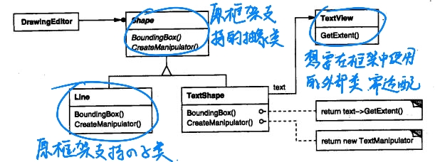
   **想实现可插拔式适配器**

   ```c++
     // Adapter
     class Adapter : public Beverage  {
          std::function<void(int)> Request;
     public:
         Adapter(CoffeMaker *cm1){
              Request = [cm1](int quantity) {  
                         cm1->Brew(quantity,80);};}
         Adapter(JuiceMaker *jm1){
               Request = [jm1](int quantity){
                       jm1->Squeeze(quantity);};}
          void getBeverage(int quantity){
                   Request(quantity);}
     };
   ```

----

<div STYLE="page-break-after: always;"></div>

# 桥接模式-Bridge

1. 意图：将抽象部分与它的实现部分分离，使他们都可以独立的变化
2. 别名：Handle/Body
3. 动机：某类的实现可能会有多种方式，但是这二者都可能改变
4. 适用性：
   * 不希望在抽象和它的实现部分之间有一个固定的绑定关系
   * 类的抽象以及它的实现都应该可以通过生成子类的方法加以扩充
   * 对一个抽象的实现部分的修改应对客户不产生影响
   * **桥接模式**和**策略模式**的区别
     * 策略模式：运行时切换，面向一个操作，是行为型模式
     * 桥接模式：类层级别，是一个结构型模式
5. 结构：
   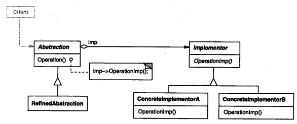
6. 参与者：
   * Abstraction：定义抽象类的接口、维护一个指向Implementor类型对象的指针
   * RefinedAbstraction：扩充由Abstraction定义的接口
   * Implementor：定义实现类的接口，该接口不一定要与Abstraction的接口完全一致
   * ConcreteImplementor：实现Implementor的接口并定义它的具体实现
7. 效果：有如下优点
   * 分离接口以及实现部分
   * 提高可扩充性
   * 实现细节对客户透明

----

<div STYLE="page-break-after: always;"></div>

# 组合模式-Composite

1. 意图：
   * 将对象组合成树形结构以表示 “部分-整体” 的层次结构
   * 使得用户对单个对象和组合对象的使用具有一致性
2. 动机：统一具有相同、类似操作的类
3. 适用性：同意图
4. 结构：
   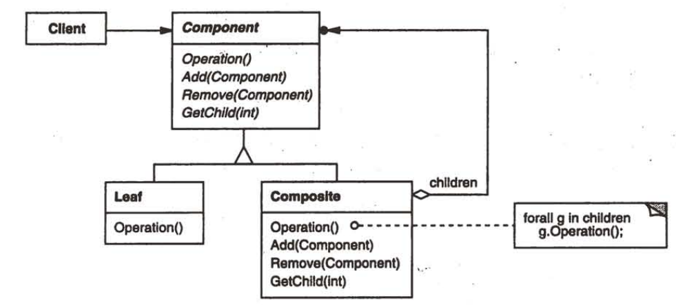
5. 参与者：
   * Component：声明对象接口、实现缺省行为、声明用于访问和管理Component子组件的接口、访问父部件（可选）
   * Leaf：表示叶节点对象，无子节点、定义对象的行为（实现接口）
   * Composite：定义有子组件部件的行为、存储子部件、在Component接口中实现与子部件有关的操作
   * Client：通过Component接口操纵组合部件的对象
6. 协作：对象接收到某操作后，Composite会将操作转发给所有子组件，Leaf会直接执行操作
7. 效果：
   * 可扩展性：添加新组件会很简单
   * 设计更一般化：很难限制组合中的组件，即难以限制某组合中只有A、B、C组件
8. 例子：
   **实现包含IF-ELSE、DO-WHILE语句的分析模型**
   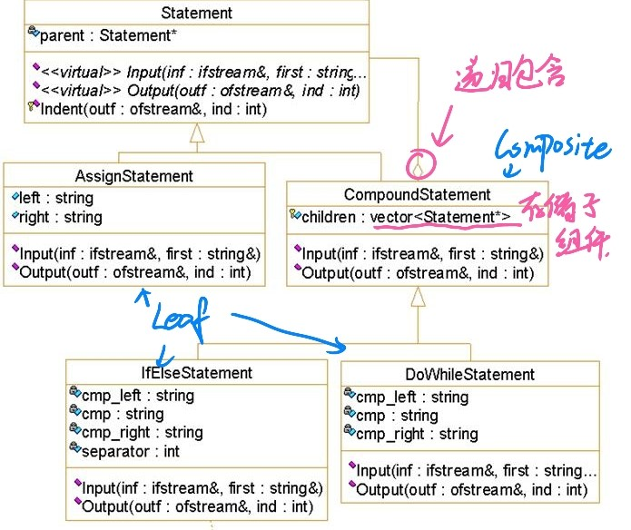

----

<div STYLE="page-break-after: always;"></div>

# 装饰器模式-Decorator

1. 意图：动态地给一个对象添加一些额外的职责。

2. 别名：包装器-Wrapper

3. 动机：有时我们希望给某个对象而不是整个类添加一些功能。

4. 适用性：

   * 在不影响其他对象的情况下，以**动态**、**透明**的方式给单个对象添加指责
   * 处理那些可以撤销的职责
   * 当不能采用生成子类的方法进行扩充时
   * :exclamation: 用子类继承的方式实现的缺点：
     1. 不能实时添加或删除某些功能
     2. 如果有许多装饰性的功能，将会发生子类数爆炸的情况

5. 结构：
   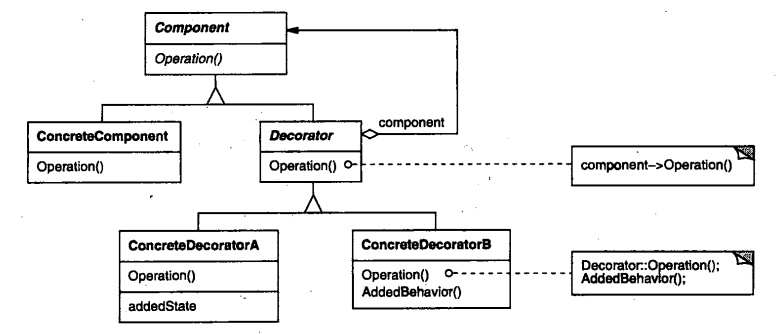

6. 参与者：

   * Component：定义一个对象接口，可以给这些对象动态地添加职责
   * ConcreteComponent：定义一个对象，可以给这个对象添加一些职责
   * Decorator：维持一个指向Component对象的指针，并定义一个与Component接口一致的接口
   * ConcreteDecorator：向组件添加职责

7. 协作：Decorator将请求转发给它的Component对象，并有可能在转发请求前后执行一些附加动作

8. 效果：装饰器可以被递归地嵌套
   两个优点

   1. 比静态继承更灵活：不会产生很多的新类、很容易重复添加某个特性
   2. 避免在层次结构高层的类有太多的特征

   两个缺点

   1. :question:Decorator与它的Component不一样，**所以装饰时不应该依赖对象标识**
   2. :question:有许多小对象

9. Decorator和Composite的比较

   1. Decorator pattern is a degenerate composite pattern
   2. Decorator是为了添加额外功能；Composite是为了对象的聚合（组合）

10. 例子：
    **实现I/O流类**
    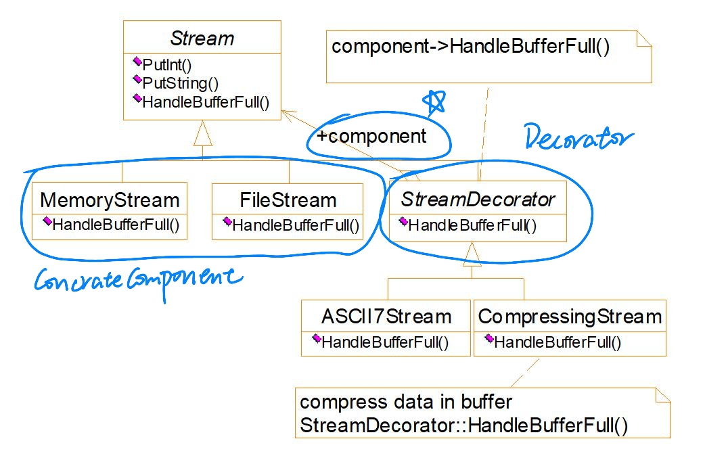

----

<div STYLE="page-break-after: always;"></div>

# 外观模式-Facade

1. 意图：为子系统中的一组接口提供一个一致的界面，Facade模式定义了一个高层接口，这个接口使得这一子系统更加容易使用
2. 动机：将一个系统划分为若干个子系统有利于降低系统的复杂性。但是划分之后组合的工作往往是比较复杂的，所以会有一些高层接口为用户封装这些功能，这样的封装被称为引入一个外观对象（facade）
3. 适用性：
   * 当要为一个复杂子系统提供一个简单接口时
   * 客户程序与抽象类的实现部分之间存在着很大的依赖性
   * 当需要构建一个层次结构的子系统时，让各层次通过facade沟通，会大大降低沟通成本
4. 结构：
   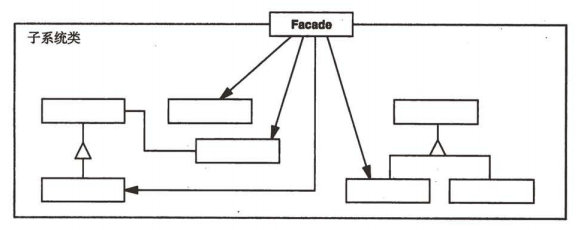
5. 参与者：
   * Facade：知道哪些子系统类负责处理请求、将客户的请求代理给适当的子系统对象
   * Subsystem Classes：
     * 实现子系统的功能
     * 处理由Facade对象指派的任务
     * 没有facade的任何相关信息，即不存在指向facade的指针
6. 效果：有如下优点
   * 对客户屏蔽子系统组件，因而减少了客户处理的对象的数目并使得子系统使用起来更加方便
   * 实现了子系统与客户之间的松耦合关系
   * 如果应用需要，facade并不限制它们使用子系统

----

<div STYLE="page-break-after: always;"></div>

# 代理模式-Proxy

1. 意图：为其他对象提供一种代理，以控制对这个对象的访问

2. 别名：Surrogate

3. 动机：对于一个文档软件，如果加载文档中所有的图片至对象中，不可避免的会有巨大的开销，这时候就需要一个代理来暂时代表那些暂时不会被加载的图片，等到需要的时候再通过代理加载他们；还可以用于解决指针的创建和销毁问题

4. 适用性：

   * 远程代理（Remote Proxy）：为一个对象在不同的地址空间提供局部代表
   * 虚代理（Virtual Proxy）：根据需要，创建开销很大的对象
   * 保护代理（Protection Proxy）：控制对原始对象的访问
   * 智能指引（Smart Reference）：取代了简单的指针，它在访问对象时执行一些附加操作

5. 结构：
   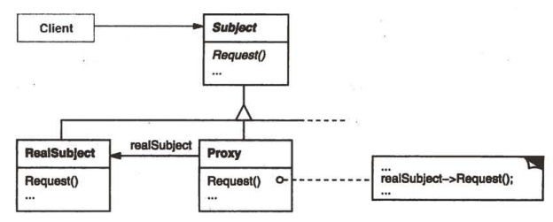

6. 参与者：

   * Proxy：
     * 保存一个引用使得代理可以访问实体
     * 提供一个与Subject接口相同的接口，这样代理就可以替代实体
     * 控制对实体的存取，并可能负责创建和删除它
   * Subject：定义RealSubject和Proxy的共同接口，这样在能使用RealSubject的地方就能使用Proxy
   * RealSubject：定义Proxy所代表的实体

7. 例子：
   **智能删除指针**

   ```c++
   template <class Item>
   class IteratorPtr {
   	public:
   		IteratorPtr( Iterator<Item> * i) : _i(i) {}
   		~IteratorPtr() { delete _i; }
   		Iterator<Item>* operator->() { return _i; }
   		Iterator<Item>& operator*() { return * _i; }
   	private:
       	// to avoid multiple deletions of _i
   		IteratorPtr(const IteratorPtr & );
   		IteratorPtr& operator=(const IteratorPtr&);
   	private:
   		Iterator<Item>* _i;
   }
   ```

----

<div STYLE="page-break-after: always;"></div>

# 职责链模式-Chain Of Responsibility

1. 意图：使多个对象都有机会处理请求，从而避免请求的发送者和接收者之间的紧耦合关系
2. 动机：在一个应用中点击下帮助按钮，能否根据当前的上下文和类型，做出适当的反馈
3. 适用性：
   * 有多个的对象可以处理同一请求，哪个对象处理该请求会在运行时确定
   * 想在不明确指定接收者的情况下，向多个对象中的一个提交一个请求
   * :question:可处理一个请求的对象集合应被动态制定
4. 结构：
   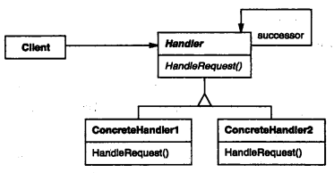
5. 参与者：
   * Handler：定义一个处理请求的接口、（可选）:question:实现后继链
   * ConcreteHandler：
     * 处理它所负责的请求
     * 可访问它的后继者
     * 如果可处理请求就处理，不能就转发给后继者
   * Client：向链上的具体处理者（ConcreteHandler）对象提交请求
6. 效果：
   * 降低耦合度
   * 增强了给对象指派职责的灵活性
   * 不保证被接受

----

<div STYLE="page-break-after: always;"></div>

# 命令模式-Command

1. 意图：将一个请求封装为一个对象，从而用不同的请求对用户参数化；对排队请求或记录请求日志，以及支持可撤销的操作；多组件对应统一操作；实现操作的类和实现接口的类要松耦合
2. 别名：动作（Action）、事务（Transaction）
3. 动机：
4. 适用性：
   * 支持撤销
   * 支持上下文相关菜单
   * 支持命令宏
   * 支持日志修改、恢复一个崩溃的系统
   * 支持在信息系统中支持事务
5. 结构：
   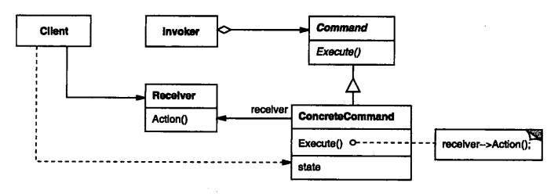
6. 参与者：
   * Command：声明执行操作的接口
   * ConcreteCommand：将一个接收者对象绑定于一个动作、调用接收者相应的操作，以实现Execute
   * Client：创建一个具体命令对象，并设定它的接收者
   * Invoker：要求该命令执行这个请求
   * Receiver：知道如何实施与执行一个请求相关的操作，任何类都可能作为一个接收者
7. 协作：
   * Client创建一个ConcreteCommand对象，并指定它的Receiver对象
   * 某Invoker对象存储该ConcreteCommand对象
   * 该Invoker对象通过调用Command对象的Execute操作来提交一个请求。若该命令是可撤销的，ConcreteCommand就在执行Execute前存储当前状态
   * ConcreteCommand对象对调用它的Receiver的一些操作以执行该请求
8. 例子：
   **一个文档应用程序**
   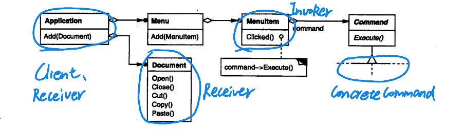

----

<div STYLE="page-break-after: always;"></div>

# 解释器模式-Interpreter

1. 意图：给定一个语言，定义它文法的一种表示，并定义一个解释器，这个解释器使用该表示来解释语言中的句子
2. 动机：应用复合模式时，如何自叶节点开始到根节点执行所对应的操作？通常需要对对象树进行递归操作。解释器模式便用于此类操作
3. 适用性：
   * 文法比较简单。因为如果文法比较复杂，文法的类层次会变得庞大而无法管理，此时语法分析程序生成器这样的工具是更好的选择
   * 效率不是一个关键问题。因为直接解释语法分析树不是最高效的方法
4. 结构：
   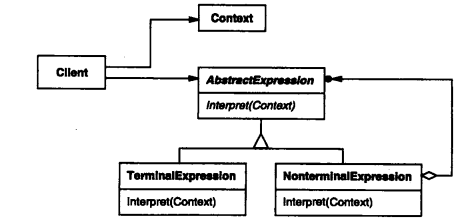
5. 参与者：
   * AbstractExpression（抽象表达式）：声明一个抽象的解释操作，这个接口为抽象语法树中所有的节点所共享
   * TerminalExpression（终结符表达式）：实现与文法中终结符相关联的解释操作、一个句子中的每个终结符需要该类的一个实例
   * NonterminalExpression（非终结符表达式）：
     * 对文法中每一条规则都需要一个非终结符表达式类
     * 为每个符号都维护一个AbstractExpression类型的实例变量
     * 为文法中的非终结符实现解释（Interpret）操作
   * Context（上下文）：包含解释器之外的一些全局信息
   * Client：构建相应的抽象语法树、调用解释操作
6. 效果：优点与不足
   * 易于改变和扩展文法
   * 易于实现文法
   * 复杂的文法难以维护
   * 增加了新的解释表达式的方式
7. 例子：
   **:question:支持And 和 变量的简单解释器**
   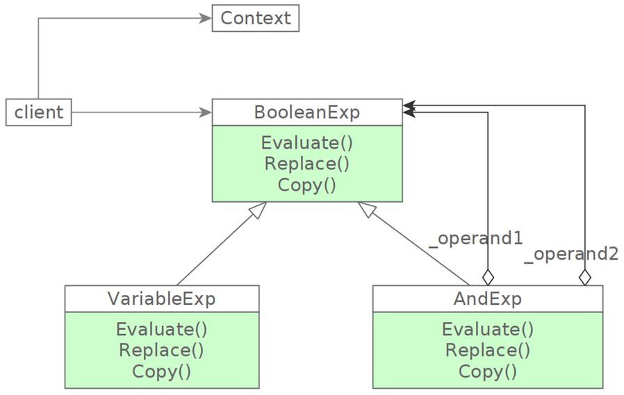

----

<div STYLE="page-break-after: always;"></div>

# 迭代器模式-Iterator

1. 意图：提供一种方法顺序访问一个聚合对象中各个元素，而又不暴露该对象的内部表示
2. 别名：游标（Cursor）
3. 动机：同意图
4. 适用性：
   * 支持访问一个聚合对象的内容而无需暴露它的内部表示
   * 支持对聚合对象的多种遍历
   * 为遍历不同的聚合结构提供一个统一的接口
5. 结构：
   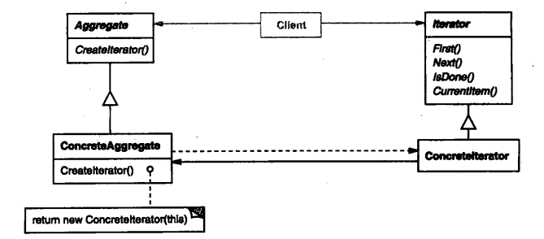
6. 参与者：
   * Iterator（迭代器）：定义访问和遍历元素的接口
   * ConcreteIterator（具体迭代器）：具体迭代器实现迭代器接口、对该聚合遍历时跟踪当前位置
   * Aggregate（聚合）：定义**创建相对应迭代器对象**的接口
   * ConcreteAggregate（具体聚合）：实现创建相应迭代器的接口，该操作返回ConcreteIterator的一个适当的实例
7. 协作：ConcreteIterator跟踪聚合中的当前对象，并能够计算出待遍历的后继对象
8. 效果：
   * 支持以不同的方法遍历一个聚合（先序、中序、后序）
   * 简化了聚合的接口
   * 同一个聚合可以有多个遍历

----

<div STYLE="page-break-after: always;"></div>

# 观察者模式-Observer

1. 意图：定义对象间的一种一对多的依赖关系，当一个对象的状态发生改变时，所有依赖于它的对象都得到通知并被自动更新
2. 别名：依赖（Dependents）、发布-订阅（Publish-Subscribe）
3. 动机：将一个系统分割成一系列相互协作的类有一个常见的副作用：需要维护它们的一致性，为了不降低它们的可重用性，不希望为了一致性而耦合它们
4. 适用性：
   * 当一个抽象模型有两个方面，其中一个方面依赖于另一方面
   * 当对一个对象改变时，需要同时改变其他对象
   * 当一个对象必须通知其他对象，而它又不能确定其他对象是谁
5. 结构：
   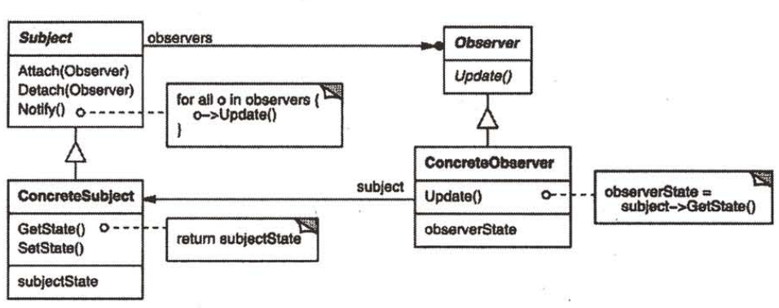
6. 参与者：
   * Subject（目标）：需要知道它的观察者、提供注册和删除观察者对象的接口
   * Observer（观察者）：为那些在目标发生改变时须获得通知的对象定义一个更新接口
   * ConcreteSubject（具体目标）：
     * 将有关状态存入各ConcreteObserver对象
     * 当它的状态发生改变时，向它的各个观察者发出通知
   * ConcreteObserver（具体观察者）：
     * 维护一个指向ConcreteSubject对象的引用
     * 存储有关状态，这些状态应与目标的状态保持一致
     * 实现Observer的更新接口以使自身状态与目标的状态保持一致
7. 效果：
   * 目标和观察者间的抽象耦合
   * 支持广播通信
   * 意外的更新

----

<div STYLE="page-break-after: always;"></div>

# 策略模式-Strategy

1. 意图：定义一些算法，把他们封装起来，并且使它们可以互相替换，使得算法可以独立于使用它的用户而变化
2. 别名：政策模式-Policy
3. 动机：有许多算法可以对一个正文流进行分行
4. 适用性：
   * 许多相关的类仅仅是行为有异
   * 需要使用一个算法的不同变体
   * 算法使用客户不应知道的数据
   * 要点：需将算法和数据分离开
5. 结构：
   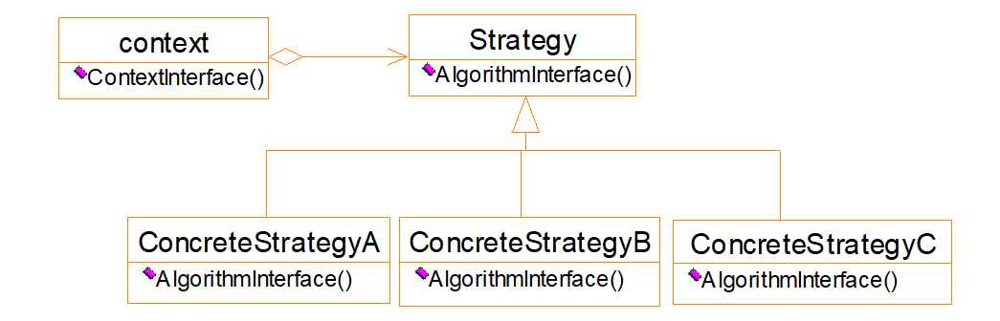
6. 参与者：
   * Strategy：定义所有支持算法的公共接口
   * ConcreateStrategy：实现Strategy接口的具体算法
   * Context：用一个ConcreateStrategy来配置、维护一个对Strategy对象的引用、可定义一个借口来让Strategy访问它的数据
7. 协作：
   * Strategy与Context相互作用以实现选定的算法
   * Context可以将用户的请求转发给Strategy
8. 效果：
   * Context的子类也可以实现不同的算法
   * 缺点：较难动态地改变算法、用户必须了解所有Strategy才能选择最合适的算法
9. 例子-Composition & Compositor 
   *Composition可以理解为作品，compositor可以理解为作者*
   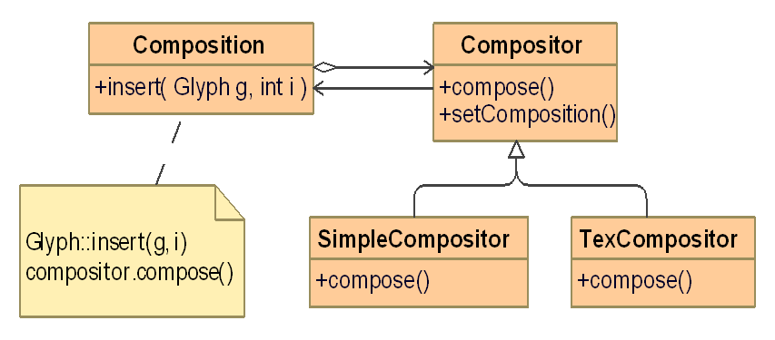

----

<div STYLE="page-break-after: always;"></div>

# 访问者模式-Visitor

1. 意图：表示一个作用于某对象结构中的各元素的操作。它使你可以在不改变各元素的类的前提下定义作用于这些元素的新操作

2. 动机：

   * 考虑一个编译器，在分析一颗抽象语法树时，某操作可能会因为语句类型不同而不同。例如**类型判断**在 *声明* 和 *赋值*  时就不同。那么类型判断该怎么实现呢？如果侵入式地将功能分别写进两个类，那么每增加一个功能都需要修改所有的语句类，并且还会使整个系统难以理解、难以维护和修改。
   * 使用Visitor模式，必须定义两个类层次，一个对应于接受操作的**元素（Node）**、一个对应于定义对元素的操作的**访问者（NodeVisitor）**

3. 适用性：

   * 一个对象结构包含很多类对象，它们有不同的接口，而你想对这些对象实施一些依赖于其具体类的操作（语法树中有多种语句，现在想根据语句的种类来用不同的分析方法）
   * 需要对一个对象结构中的对象，进行很多不同的并且不相关的操作，而你想避免让这些操作“污染”这些类
   * 定义对象结构的类很少改变，但经常需要在此结构上定义新的操作

4. 结构：
   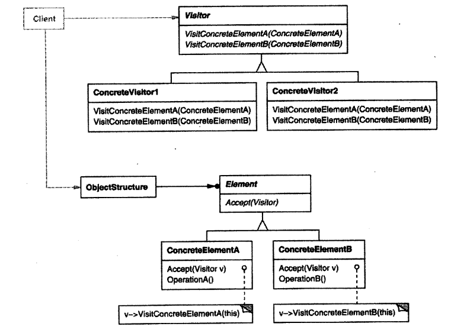

5. 参与者：

   * Visitor（访问者）：为该对象结构中的ConcreteElement的每一个类，声明一个Visit操作
   * ConcreteVisitor（具体访问者）：实现每个由Visitor声明的操作。ConcreteVisitor其实是实现了某个具体的功能在不同类之中的实现，例如：类型判断于声明和赋值中如何分别操作的
   * Element：定义一个Accept操作，它以一个访问者为参数
   * ConcreteElement（具体元素）：实现Accept操作，以操作一个访问者为参数
   * ObjectStructure（对象结构）：能枚举它的元素、可以提供一个高层的接口以允许该访问者访问它的元素、可以是一个复合或是一个集合

6. 效果：优缺点

   * 访问者模式使得易于增加新的操作

   * 访问者集中相关的操作，而分离无关的操作

   * 增加新的ConcreteElement类很困难

   * 通过类层次进行访问：迭代器只能访问有共同父类的Item，然而访问者没有这个限制

     ```c++
     class Visitor{
         public:
         void VisitAType(A*);
         void VisitBType(B*);
     }
     ```

   * :question:累积状态

   * 破坏封装：访问者方法假定ConcreteElement接口的功能足够强，足以让访问者进行他们的工作，但是往往这样的条件无法达成，迫使提供元素内部状态的公共操作，这可能会破坏它的封装性

----

